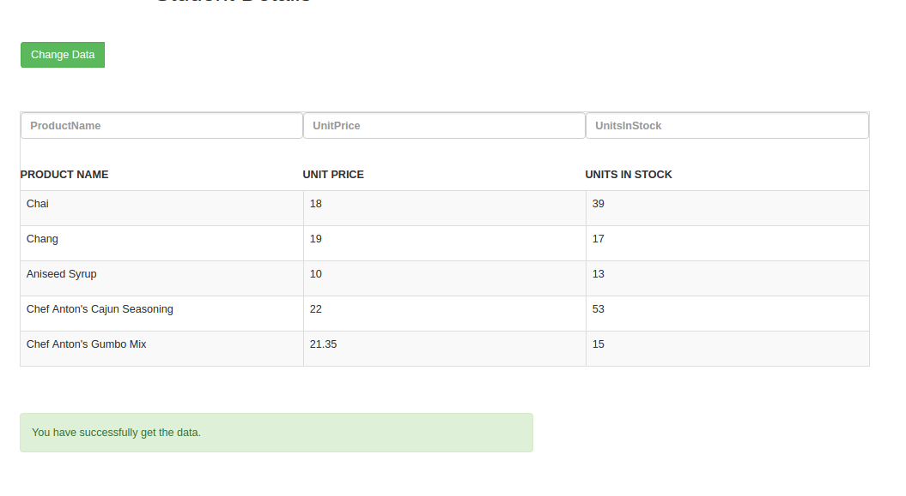

# Custom DataTable

The UI DataTable is a control for displaying data in a tabular format. It provides many options, such as sorting, filtering, and hide which determine the way data is presented and manipulated. The DataTable can be bound to local or remote data by using the UI DataSource and Option component.

## Column Configuration

This column setting use for default setting of DataTable. Column setting can handle width, filter, and hide the individual column.

```
    this.empHeaderDS = [
      { field: 'empNo', title: 'Emp ID', width: '100px', filterable: true, hidden: true },
      { field: 'name', title: 'Name', width: '100px', filterable: true, hidden: false },
      { field: 'education', title: 'Education', width: '100px', filterable: true, hidden: false },
      { field: 'year', title: 'Year', width: '100px', hidden: false, filterable: true, },
      { field: 'institute', title: 'Institute', width: '100px', hidden: false, filterable: true, }
    ];

```

## UI Configuration

User need to share data source or datalink with apropriate column config in option attribute for Custom DataTable. Please check below shared attributs list with proper assign value.

```

<app-DataTable [option]="generalOption" [dataSource]="generalData" [sort]="sorting" ></app-DataTable>

```


### Type of share the datasource to DataTable

* User can share data source using tow type.
    * JSON data
    * Link data with type
        
JSON data :      

```
   this.empHeaderDS = [
      { field: 'empNo', title: 'Emp ID', width: '100px', filterable: true, hidden: true },
      { field: 'name', title: 'Name', width: '100px', filterable: true, hidden: false },
      { field: 'education', title: 'Education', width: '100px', filterable: true, hidden: false },
      { field: 'year', title: 'Year', width: '100px', hidden: false, filterable: true, },
      { field: 'institute', title: 'Institute', width: '100px', hidden: false, filterable: true, }
    ];

```

Link data with type :

```
    this.generalData = {
    ContentType: "application/json",
    Url: "https://ethereal-honor-168405.firebaseio.com/array.json?auth=" + this.token} 

``` 

## UI for DataTable



## Deployment instructions

```
# Install npm package :

> npm install | npm install -g @angular/cli

# BootStrap package :

> npm install --save bootstrap

# Firebase package :

> npm install --save firebase

```

For development builds use the usual `ng serve` and `ng build` commands.


### Development server

Run `ng serve` for a dev server. Navigate to `http://localhost:4200/`. The app will automatically reload if you change any of the source files.

### Build

Run `ng build` to build the project. The build artifacts will be stored in the `dist/` directory. Use the `-prod` flag for a production build.